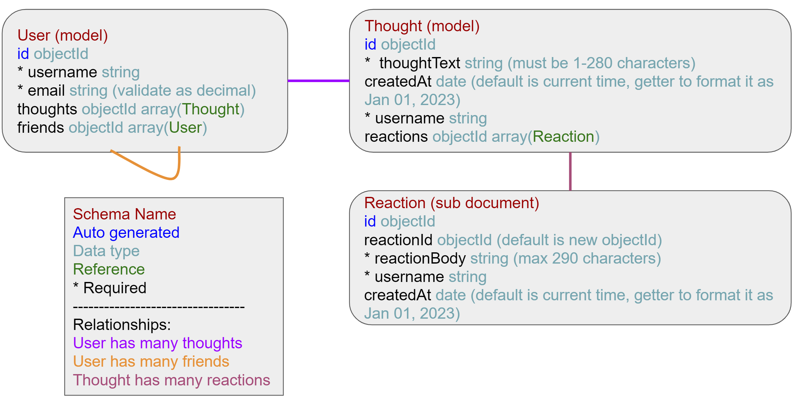

# Social Network Api

## Description
This applications builds a social network api that can handle large amounts of unstructured data using NoSQl.

## Table of Contents
- [Installation](#installation)
- [Usage](#usage)
- [License](#license)
- [Contributing](#contributing)
- [Contact](#contact)

## Installation
Download code from the GitHub repository. Have Node.js installed. Link to Node.js downloads: https://nodejs.dev/en/download/. Then in the terminal install dayjs, express, mongoose, nodemon (used for dev) by inputting npm install.

## Usage
The user will need to have MongoDb and connect to localhost:27017.

To interact with the api the user needs to input either npm start or npm run dev (this allows the server to restart when there is change in code). If successful the documents will have been created.

On the appliction Insomina or other applications that allow the user to see the ressults of server requests, the user can test the get, post, put, and delete methods for each document. If the request was sucessful the user will see a json repsonse with the result. If it failed you will see a message saying it coult not find the data or giv an error json.

The schema has Users, Thoughts (like a post), and Reactions (replies to a thought). User has a virtual to count their friends and Thought has a virtual to count its reactions.

Schema:

Video demonstration:

## License
 This application is covered under MIT License.

You can click on the badge for further information.

## Contributing

Packages used:

- dayjs (formats the date): https://www.npmjs.com/package/dayjs

- express (server functions): https://www.npmjs.com/package/express 

- mongoose (tool to interact with NoSql MongoDB): https://www.npmjs.com/package/mongoose

- nodemon (allows server to restart if there is change in the code): https://www.npmjs.com/package/nodemon

## Contact
GitHub profile: https://github.com/CYMcolor
